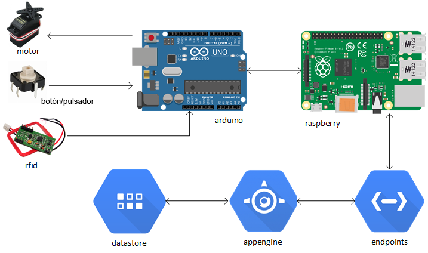

# Candy Point

The candy point machine, a project created by enthusiastic developers.

## Getting Started

Project for the creation of a candy box (candy point) where users use an RFID card to open the box and get their prize based on their available points.
To assemble this project the following elements are necessary.

## Overview

This is the architecture diagram of the project:

## Hardware

- Arduino UNO (we have used a Freaduino UNO from BQ)
- Two leds
- One servo
- One light sensor
- A RFID reader (we have used a RDM6300 reader)
- An OLED display (we have used a 0,96 inch I2C SPI CII 128x64 LCD OLED display)
- Raspberry Pi 3
- Wooden box

## Software

We have used this software, but feel free to use the one you like:
- Arduino IDE v1.8.5
- Raspbian with Python 2.7.14 version 
- An account in Google Cloud Platform
- VS Code

## Want to replicate the project? You will need to...

Simple. Clone this proyect and feel free to modify what you want.
We come from the world of web development and we are not experts in Arduino / Raspberry or in programming in Python, but we have plenty of desire to learn and share knowledge with others.