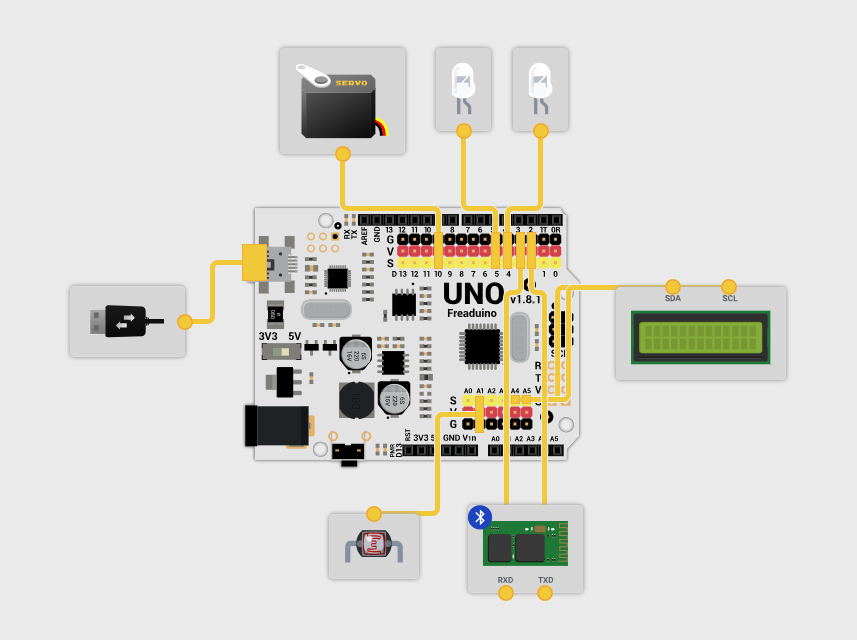

# Arduino UNO

The Arduino UNO sketch to communicate with Raspberry and manage I/O sensors, one servo, a RFID reader and a OLED display 

## Sketch

This script has been build and proved with Arduino IDE 1.8.5 version

## Getting Started

To ensure a correct use of the script you must install the following Arduino libraries:
- RDM6300 (https://github.com/arliones/RDM6300-Arduino)
- ArduinoJson (https://github.com/bblanchon/ArduinoJson)
- SSD1306Ascii (https://github.com/greiman/SSD1306Ascii)

## Connection diagrams

Detail of connections in Arduino BQ (Freaduino UNO)

RDM6300 RFID reader connection

Connection of the OLED screen 0.96 I2C SPI CII 128x64

## The Script (.ino)

This program wait for a RFID token, then send to Raspberry PI via Serial and if the user associated with this RFID has sufficient points, moves servo to unlock a door.
Upon the door is closed, which is detected when button is pressed, turns a LED on.

Data is exchanged in JSON format.

There are these types of messages:
{"type":"status","code":"init"} // Inform the raspberry that the arduino is initializing
{"type":"status","code":"ready"} // Inform the raspberry that the arduino is ready
{"type":"status","code":"waiting"} // Inform the raspberry that the arduino is waiting for a response
{"type":"request","params":{ "rfid": "0x0000000000"}} // Send a request to raspberry to obtain info about a RFID
{"type":"response","result":{ "rfid": "0x0000000000", "points": 100}} // Response received from raspberry with points associated to a RFID
{"type":"response","result":{ "rfid": "0x0000000000", "pin": 1234}} // Response received from raspberry with pin associated to a RFID

